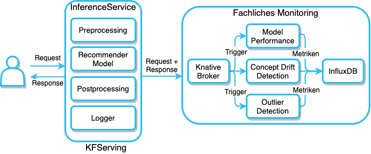
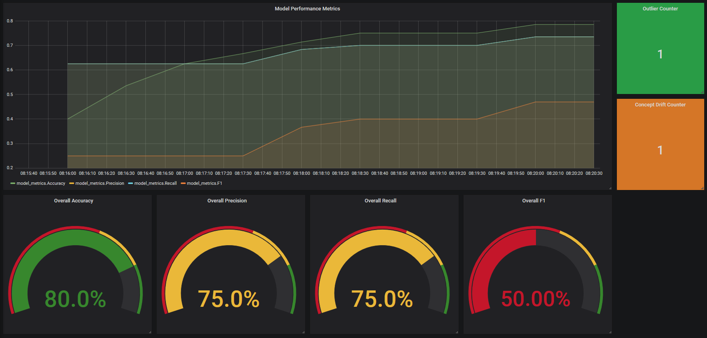

# KFServing example for Serving an ML-Recommender with Model Performance Monitoring, Outlier Detection and Concept Drift Detection
Related Blog Post: [https://www.novatec-gmbh.de/blog/ausrollen-und-betreiben-von-ml-modellen-in-produktion-mit-kfserving2/](https://www.novatec-gmbh.de/blog/ausrollen-und-betreiben-von-ml-modellen-in-produktion-mit-kfserving2/)
## Requirements
- [Requirements](https://github.com/felix-exel/kfserving#requirements) from the basic KFServing Repository 
- Private or public Container Registry
    - If you use a private Container Registry deploy docker-registry secret:
    - ```kubectl create secret docker-registry gitlab --docker-server=<docker server> --docker-username=<username> --docker-password=<token> -n kfserving-test```
- Deploy an InfluxDB Instance for example with Helm
- Install Knative Eventing:
    - ```kubectl apply --filename https://github.com/knative/eventing/releases/download/v0.18.0/eventing.yaml```
## Architecture

## Grafana Dashboard

## Get Started
Deploy Knative Broker:<br>
```kubectl apply -f broker.yaml```
### Recommender Model
- Change the StorageUri in [tf-deployment-recommender](tf-deployment-recommender.yaml) to your Cloud Path
- Build the Docker Image from /transformer_recommender folder and tag it with your registry, e.g.: 
    - ```docker build . -t registry.gitlab.com/felix.exel/ci_cd_kubernetes/kfserving/recommender_transformer```
- Push the Image to the Registry, e.g.:
    - ```docker push registry.gitlab.com/felix.exel/ci_cd_kubernetes/kfserving/recommender_transformer```
- Deploy the Recommender Model:
  - ```kubectl apply -f tf-deployment-recommender.yaml```
### Outlier Detection
- Train the Autoencoder by executing the Jupyter-Notebook [training_outlier_detection.ipynb](./outlier_detection/training_outlier_detection.ipynb)
- Upload the Autoencoder Model to a Cloud Storage, e.g. AWS S3 Bucket
- Find an Anomaly Threshold by executing the Jupyter-Notebook [find_threshold.ipynb](./outlier_detection/find_threshold.ipynb) and analyzing your reconstruction losses
- Build the Docker Image from /concept_drift_detection/docker folder and tag it with your registry, e.g.: 
    - ```docker build . -t registry.gitlab.com/felix.exel/ci_cd_kubernetes/kfserving/outlier-detection-transformer```
- Push the Image to the Registry, e.g.:
    - ```docker push registry.gitlab.com/felix.exel/ci_cd_kubernetes/kfserving/outlier-detection-transformer```
- Deploy the Outlier Detection Component:
  - ```kubectl apply -f outlier-detection.yaml```
- Deploy Trigger:
  - ```kubectl apply -f trigger.yaml```
### Concept Drift Detection
- Create the Concept Drift Model by executing the Jupyter-Notebook [create_model_concept_drift_detection.ipynb](./concept_drift_detection/create_model_concept_drift_detection.ipynb)
- Move the saved model directory to the docker folder
- Build the Docker Image from /concept_drift_detection/docker folder and tag it with your registry, e.g.: 
    - ```docker build . -t registry.gitlab.com/felix.exel/ci_cd_kubernetes/kfserving/cd```
- Push the Image to the Registry, e.g.:
    - ```docker push registry.gitlab.com/felix.exel/ci_cd_kubernetes/kfserving/cd```
- Deploy the Concept Drift Model:
  - ```kubectl apply -f concept-drift.yaml```
- Deploy Trigger:
  - ```kubectl apply -f trigger.yaml```
### Grafana Dashboard
Import the Grafana Dashboard in grafana_dashboard folder
### Start requesting the ML-Recommender Service by using the [request_recommender_service.ipynb](request_recommender_service.ipynb) Notebook